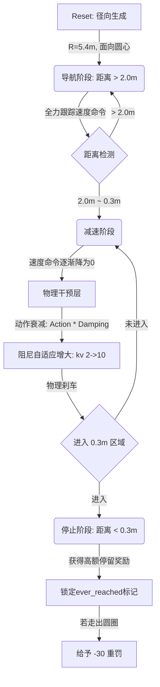

# 训练技术问答

## 一、训练简述

### 1. 训练方式

采用 **PPO（Proximal Policy Optimization）** 算法进行强化学习训练，使用 **SKRL** 框架实现，支持 JAX 和 PyTorch 双后端。训练时使用 2048 个并行仿真环境同时采集经验，通过 MotrixSim 物理引擎驱动仿真，仿真步长为 10ms（100Hz）。训练过程中，每个环境独立运行一个机器狗实例，从随机起始位置导航到固定目标点，单个 episode 最大时长 40 秒（4000 步）。

### 2. 模型结构

使用 **Actor-Critic** 架构，策略网络（Policy）和价值网络（Value）结构独立，不共享特征层：

| 网络 | 结构 | 激活函数 |
|------|------|---------|
| 策略网络（Actor） | 54 → 256 → 128 → 64 → 12 | ELU |
| 价值网络（Critic） | 54 → 256 → 128 → 64 → 1 | ELU |

- **输入（54维）**：线速度(3) + 角速度(3) + 投影重力(3) + 关节角度(12) + 关节速度(12) + 上一步动作(12) + 速度命令(3) + 位置误差(2) + 朝向误差(1) + 距离(1) + 到达标记(1) + 停稳标记(1)
- **输出（12维）**：12 个关节的目标动作（经 action_scale=0.25 缩放后叠加到默认关节角度，由 PD 控制器转为力矩）

### 3. 关键超参

| 参数 | 值 | 影响说明 |
|------|-----|---------|
| `num_envs` | 2048 | 并行环境数，直接影响训练速度和梯度质量 |
| `learning_rate` | 3e-4 | 学习率，过大易不稳定，过小收敛慢 |
| `rollouts` | 24 | 每次更新前采集的步数，影响经验多样性 |
| `learning_epochs` | 5 | 每批数据的训练轮次，影响样本效率 |
| `mini_batches` | 3 | 小批次数量，与 rollouts 共同决定 batch size |
| `discount_factor` | 0.99 | 折扣因子，决定长期 vs 短期奖励的偏好 |
| `lambda_param` | 0.95 | GAE 参数，控制 bias-variance 权衡 |
| `ratio_clip` | 0.2 | PPO 裁剪范围，防止策略更新过大 |
| `action_scale` | 0.25 | 动作缩放系数，控制关节运动幅度 |
| `max_env_steps` | 61,440,000 | 总训练步数（1024×60000） |
| `kp / kv` | 80.0 / 2.0~8.0 | PD 控制器增益，kv 在目标区域内自适应增大到 8.0 以实现物理刹车 |

### 4. 奖励简述

奖励函数按"是否到达目标区域"分为两套独立计算逻辑：

#### 未到达目标时（导航阶段）

| 奖励项 | 权重 | 说明 |
|--------|------|------|
| 线速度跟踪 | +1.5 | `exp(-error²/0.25)`，鼓励跟踪期望速度命令 |
| 角速度跟踪 | +0.3 | 鼓励朝目标方向转向 |
| 距离接近奖励 | +4.0/m | 基于历史最小距离的增量奖励，鼓励持续靠近目标 |
| 姿态偏差惩罚 | -0.5 | 投影重力与 [0,0,-1] 的偏差，防止侧翻 |
| Z 轴线速度惩罚 | -2.0 | 惩罚弹跳 |
| XY 轴角速度惩罚 | -0.05 | 惩罚身体晃动 |
| 力矩惩罚 | -1e-5 | 节能，减少不必要的力矩输出 |
| 动作变化率惩罚 | -0.001 | 平滑动作，减少抖动 |
| 腿部不对称惩罚 | -0.1 | 惩罚四腿使用不均匀（★自定义） |
| 关节偏差惩罚 | -0.01 | 鼓励关节角度接近默认站姿 |
| 走出圆圈惩罚 | -30.0 | 曾进入目标区域后又走出，给予强惩罚（★自定义） |
| 终止惩罚 | -20.0 | 侧翻/基座触地/关节速度异常 |

#### 到达目标后（停止阶段）

| 奖励项 | 权重 | 说明 |
|--------|------|------|
| 首次到达奖励 | +10.0 | 一次性奖励，首次进入 0.3m 半径时触发 |
| 完全停稳奖励 | +20.0 | 速度<0.05m/s 且角速度<0.03rad/s 时触发（★增强） |
| 基础停止奖励 | ~5×(0~2) | 速度和角速度的高斯衰减，越小奖励越高（★增强） |
| 持续停留奖励 | +5.0/步 | 每步在目标区域内就给奖励（★增强） |
| 速度惩罚 | -15.0v² | 到达后仍有速度则强惩罚（★增强） |
| 稳定性惩罚 | 同上 | 姿态/弹跳/晃动/力矩等惩罚同样生效 |
| 终止惩罚 | -20.0 | 同上 |

> **★自定义/修改的奖励细节：**
>
> 1. **动作衰减机制**（非奖励，但直接影响停止效果）：在 `apply_action` 中，根据到目标距离将策略输出的 actions 线性衰减到零（0.5m 开始，0.15m 完全归零），并自适应增大 PD 控制器的速度阻尼 kv（2.0→8.0），从物理层面强制机器狗停下。
> 2. **走出圆圈惩罚**：通过 `ever_reached` 粘性标记追踪机器狗是否曾进入过目标区域，一旦走出则给 -30.0 强惩罚。
> 3. **腿部不对称惩罚**：计算四条腿关节偏差的最大值与最小值之差，鼓励四腿均匀使用，防止单腿拖地。
> 4. **减速区设计**：在 `update_state` 的速度命令生成中，距离目标 2m 时开始线性降低速度命令，到 0.3m 时速度命令归零，让策略"看到"的目标速度本身就在减小。

### 5. 文件说明

| 文件 | 作用 |
|------|------|
| `scripts/train.py` | 训练入口脚本，解析命令行参数并启动 PPO 训练 |
| `motrix_rl/src/motrix_rl/cfgs.py` | RL 训练超参配置（网络结构、学习率、rollouts 等），按任务注册 |
| `motrix_rl/src/motrix_rl/skrl/cfg.py` | PPO 算法基础配置类，定义所有 PPO 超参的默认值 |
| `motrix_envs/src/motrix_envs/navigation/vbot/vbot_section001_np.py` | 环境核心实现：观测计算、动作执行、奖励函数、终止条件、重置逻辑 |
| `motrix_envs/src/motrix_envs/navigation/vbot/cfg.py` | 环境配置：起始位置、目标范围、归一化系数、关节默认角度等 |
| `motrix_envs/src/motrix_envs/navigation/vbot/__init__.py` | 环境注册入口，将环境类与配置名称关联 |
| `motrix_envs/src/motrix_envs/navigation/vbot/xmls/` | MuJoCo 地形和机器人模型文件（scene_section001.xml 等） |
| `scripts/play.py` | 训练完成后的回放脚本，加载模型权重并可视化运行 |

## 二、第一赛段训练策略

### 1. 整体训练思路

训练的核心目标是让机器狗从圆盘边缘的白色箭头起始点，稳定地导航并精确停留在圆心的红色目标区域。

**训练逻辑流程图：**

1.  **径向重置（Radial Reset）**：每次重置时，机器狗不会出现在固定点，而是随机出现在半径 5.4m 的圆周（白色箭头处），且出生时自带面向圆心的初始朝向。
2.  **分段控制策略**：
    *   **远距离（>2m）**：常规导航，通过 PPO 学习步态和路径规划。
    *   **近距离（0.3m - 2m）**：引入"物理刹车手柄"。环境逻辑会主动降低速度命令，同时在代码层直接干预动作输出，强制进入刹车状态，而不只是依赖奖励函数的引导。
3.  **三层停止保障**：代码实现的`动作衰减` + `kv 自适应增强` + `停止奖励引导`，共同解决了 PPO 策略难以在高速运行中稳稳刹车的问题。

### 2. 终止条件

为了保证训练效率并防止产生破坏性的步态，定义了以下环境终止条件：

*   **基座触地**：通过底盘下方的 `base_contact` 传感器检测，一旦感应到力（>0.01），判定为摔倒，环境立即终止并给予 -20 惩罚。
*   **姿态倾斜（侧翻）**：检测投影重力的 Z 轴分量。当机器狗由于侧翻导致 Z 分量大于 -0.5（即倾斜角超过约 60 度）时判为训练失败。
*   **关节速度异常（保护机制）**：若检测到关节速度出现 NaN 或超过物理极限（MuJoCo panic 保护），强制重启环境，防止坏梯度污染网络。
*   **超时**：单个 episode 超过 40 秒未到达或未完成任务，环境重置（不给额外惩罚，仅自然重置）。

### 3. 数据处理与观测量

系统采用归一化处理后的向量作为 PPO 网络的输入，维度为 **54 维**：

*   **本体状态（33维）**：
    *   基础线速度（3）、角速度（3）、投影重力（3）——均按配置缩放。
    *   关节角度偏移（12）：`actual - default`，缩放系数 1.0。
    *   关节速度（12）：缩放系数 0.05。
*   **动作记忆（12维）**：
    *   上一步的 `filtered_actions`，用于保证动作生成的连续性和平滑度。
*   **导航任务（9维）**：
    *   速度命令（3）：[vx, vy, yaw_rate]。
    *   位置误差（2）：归一化后的 XY 坐标差。
    *   朝向误差（1）：与最终目标朝向的偏差（弧度/pi）。
    *   距离（1）：归一化后的欧氏距离。
    *   状态标记（2）：`reached_flag`（是否在圈内）和 `stop_ready_flag`（是否同时满足速度归零要求）。

### 4. 其他处理

*   **动作滤波（Action Filtering）**：采用 $\alpha=0.3$ 的一阶指数平滑滤波，对神经网络输出的 100Hz 原始动作进行平滑处理，减少对马达的冲击，提升实机部署的稳定性。
*   **力矩计算（PD Control）**：最终输出力矩遵循 $\tau = k_p(q_{target} - q) - k_v\dot{q}$。其中 $k_p=80$，$k_v$ 在常规阶段为 2.0，在圆心刹车时自动平滑过渡到 10.0。
*   **粘性状态追踪**：维护一个 `ever_reached` 标志位。该标志位在 episode 内只增不减。当标志位为 True 且机器狗当前重新跳出圆圈外时，强制触发惩罚逻辑。
